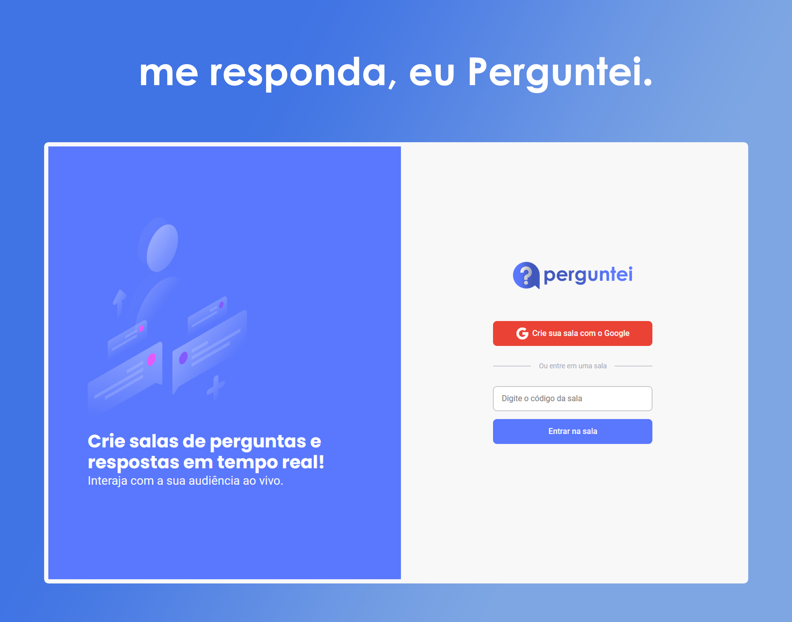
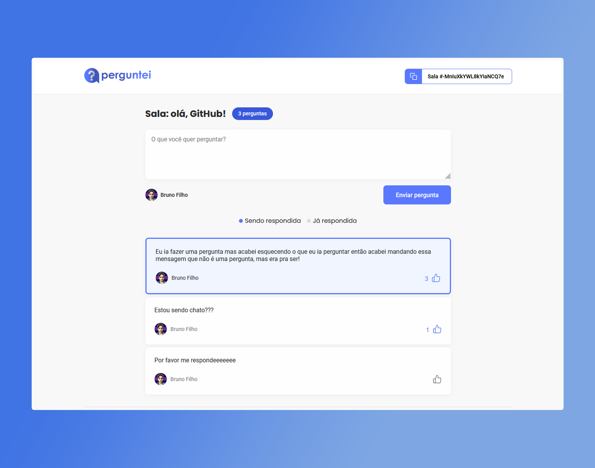
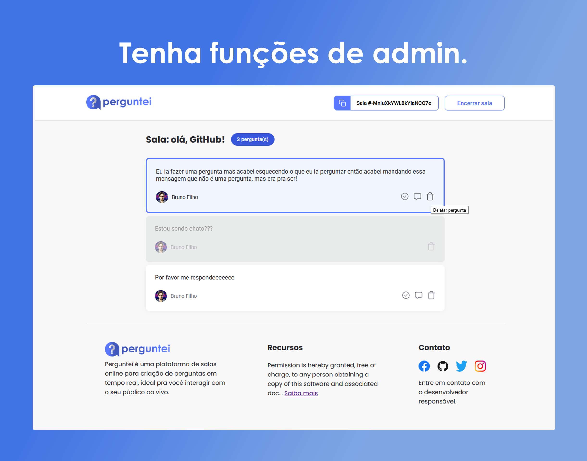

<div align="center">
  <a target="_blank" href="https://letmeask-c89f9.web.app/"></a>
</div>

<h1 align="center">
    
</h1>


## 💻 Sobre o projeto

<strong>Perguntei</strong> é uma plataforma para você criar salas de Q&A com o seu próprio público, de uma forma muito organizada, só tendo acesso a sua sala quem tiver 
o código de entrada. E só será aceito perguntas de pessoas autenticadas com a conta Google.

Por enquanto só está disponível a versão desktop sem responsividade pra mobile.

<br>

<h1 align="center">
    
</h1>

<h1 align="center">
    
</h1>

<br>

## 🧪 Tecnologias usadas

Esse projeto foi desenvolvido com as seguintes tecnologias:

- [React](https://reactjs.org)
- [SCSS](https://sass-lang.com/)
- [Firebase](https://firebase.google.com/)
- [TypeScript](https://www.typescriptlang.org/)

## 🔗  Clone a aplicação

Clone o projeto e acesse a pasta do mesmo.

```bash
$ git clone https://github.com/brunofilho1/perguntei-react-project
$ cd perguntei-react-project
```
## 🚀 Como iniciar a aplicação

Para iniciá-lo, siga os passos abaixo:
```bash
# Instalar as dependências
$ yarn
# Iniciar o projeto
$ yarn start
```
O app estará disponível no seu browser pelo http://localhost:3000 assim que iniciado.

Lembrando que será necessário criar uma conta no [Firebase](https://firebase.google.com/), depois criar um projeto para disponibilizar um Realtime Database e configurar as variáveis locais do .env.

## 🌐 Live preview
<a target="_blank" href="https://letmeask-c89f9.web.app/">Veja o site online clicando aqui.</a>

## 📝 Licença MIT

Esse projeto está sob a licença MIT. Veja o arquivo [LICENSE](LICENSE.md) para mais detalhes.

---
